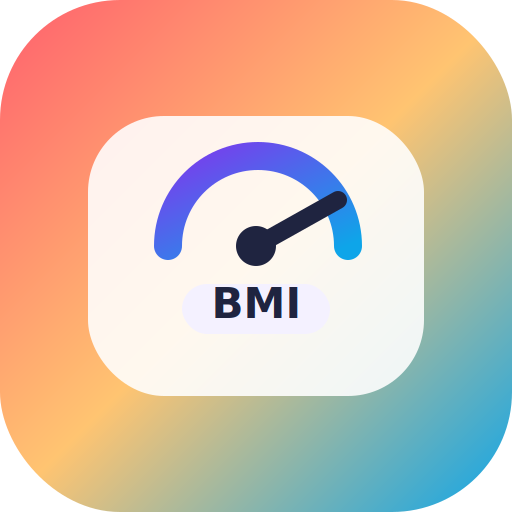

  

<h1 align="center">レインボー体重管理</h1>
<h3 align="center">Rainbow Weight Log</h3>

  写真・音声・手入力で記録できる、プライバシー重視の体重管理アプリ

---

## アプリについて

**レインボー体重管理** は、毎日の体重記録をシンプルかつ安全に行うための体重管理アプリです。

すべてのデータは端末内に保存され、外部サーバーには一切送信されません。広告やトラッキングもありません。あなたの健康データはあなただけのものです。

---

## こんな方におすすめ

- 毎日の体重を手軽に記録したい方
- プライバシーを重視する方（データを外部に送りたくない）
- グラフや統計で体重の変化を詳しく見たい方
- 声や写真で素早く入力したい方
- 日本語と英語で使いたい方

---

## 主な機能

### 3つの入力方法

<table>
<tr>
<td width="33%" align="center">

**手入力**

ピッカーUIで直感的に体重を入力。±0.1〜±1.0kgの微調整ボタン付き。

</td>
<td width="33%" align="center">

**音声入力**

「ななじゅうにてんご」と話すだけで72.5kgを自動認識。日本語・英語対応。

</td>
<td width="33%" align="center">

**写真入力**

体重計の写真からAI（OCR）で数値を検出。撮影するだけで記録完了。

</td>
</tr>
</table>

### 見やすいトレンドチャート

- 7日/30日/90日/全期間の体重推移をグラフで確認
- 移動平均線で全体のトレンドが一目でわかる
- 目標体重ラインと予測線の表示
- タッチ/ホバーで各日の詳細をツールチップ表示

### 30以上の分析指標

日々の記録から自動的に計算される豊富な分析機能：

- **短期トレンド** — 直近の増減傾向をリアルタイム表示
- **BMI分析** — BMIゾーン分類、適正体重レンジ
- **目標管理** — 進捗率、達成予測日、カウントダウン
- **記録カレンダー** — 今月の記録状況を一覧表示
- **週間平均** — 8週間の推移をバーチャートで比較
- **モメンタム** — 体重変化の勢いをスコア化
- **体脂肪率** — 体脂肪率の推移と体組成分析
- **曜日パターン** — 曜日別の傾向を発見
- **ストリーク** — 連続記録日数と達成バッジ
- **データ品質** — 重複検出、記録ギャップ分析

### 11のカラーテーマ

| テーマ | 雰囲気 |
|--------|--------|
| Prism | 鮮やかなレッド/ピンク（デフォルト） |
| Sunrise | 温かみのあるオレンジ |
| Mist | 涼しげなシアン |
| Forest | 自然のグリーン |
| Lavender | 落ち着いたパープル |
| Ocean | 深いブルー |
| Cherry | ピンクアクセント |
| **Midnight** | **ダークモード** |
| Amber | ゴールド/ウォーム |
| Rose | ディープピンク |
| Mint | フレッシュなティール |

システムのダークモード設定に応じて自動で切り替わります。

---

## プライバシーポリシー

| 項目 | 対応 |
|------|------|
| データ保存先 | 端末内のみ（localStorage） |
| 外部送信 | なし |
| 広告 | なし |
| トラッキング | なし |
| バックアップ | Google Drive（任意・ユーザー操作のみ） |
| データエクスポート | CSV / Excel いつでもダウンロード可能 |

> BMI は健康管理の参考値であり、医療診断を目的としたものではありません。

---

## 対応環境

| プラットフォーム | 対応状況 |
|------------------|----------|
| iPhone / iPad | Capacitor ネイティブアプリ |
| Web ブラウザ | PWA 対応 |
| macOS | Apple Silicon「Designed for iPad」 |

### 対応言語

- 日本語
- English

---

## スクリーンショット

> スクリーンショットは [`docs/screenshots/`](./screenshots/) に配置予定です。

<!--
スクリーンショットが用意できたら、以下のようにコメントを外してください：

  
  
  
  

-->

---

## 技術概要

- **Vanilla JavaScript** — フレームワーク不使用で軽量・高速
- **esbuild** — 高速バンドラーによるビルド
- **Vitest** — 770以上のユニットテストで品質を担保
- **Capacitor** — iOS ネイティブ機能（カメラ、音声認識）を活用
- **Canvas 2D** — ライブラリ不使用のカスタムチャート描画
- **カスタムi18n** — 1,300以上のキーで完全バイリンガル対応

---

## お問い合わせ

バグ報告や機能要望は [GitHub Issues](https://github.com/toukanno/weight-rainbow/issues) までお願いします。

---

  あなたの健康データはあなただけのもの。すべてのデータは端末内に保存されます。

